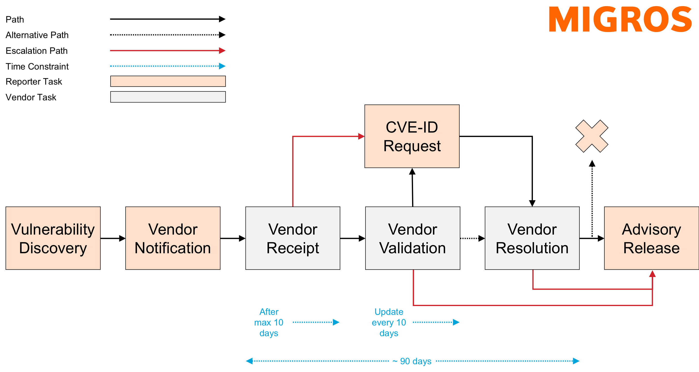

# Migros Security Advisories
Below you find a curated list of security advisories published by the Security Operations / Cyber Defense Center team of MGB (Migros-Genossenschafts-Bund) found during penetration tests or red team engagements.

## Overview
The table below provides a summary of all published advisories, including key details such as dates, identifiers, severity scores, affected vendors, and products.
| Date | MSEC ID | Vendor ID | CVE ID | CVSS 4.0 | Vendor | Product | Vulnerability | Advisory |
| --- | --- | --- | --- | --- | --- | --- | --- | --- |
| 20.05.2025 | MSEC-2025-001 | None | CVE-2024-42912 | 8.6 | META-INF | Email This Issue | Stored Cross-Site Scripting | [Open](advisories/msec-2025-001_meta-inf_email-this-issue_stored-cross-site-scripting.md) |
| 20.05.2025 | MSEC-2025-002 | ODOO-SA-2024-12-23 | CVE-2024-12368 | 8.7 | Odoo | Odoo | Read access to OAuth access tokens and account takeover | [Open](advisories/msec-2025-002_odoo_odoo_account-takeover.md) |

## Vulnerability Disclosure Process
The following figure illustrates the underlying vulnerability disclosure process, outlining the steps for reporting, managing, and resolving security vulnerabilities responsibly.

## Contact
Please contact [damiano.esposito@mgb.ch](mailto:damiano.esposito@mgb.ch) for issues relating to this repository. Please contact [media@migros.ch](mailto:media@migros.ch) for press inquiries.

