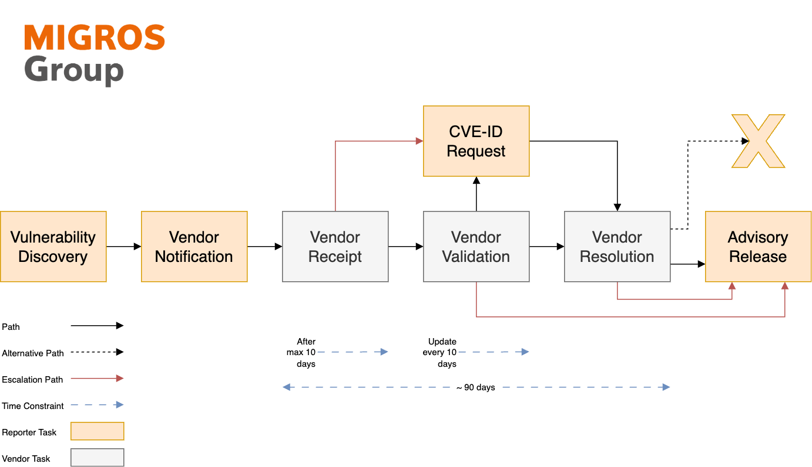

# Migros Security Advisories
[![CC BY 4.0][cc-by-shield]][cc-by]

Below you find a curated list of security advisories published by the Security Operations / Cyber Defense Center team of MGB (Migros-Genossenschafts-Bund) found during penetration tests or red team engagements.

## Overview
The table below provides a summary of all published advisories, including key details such as dates, identifiers, severity scores, affected vendors, and products.
| Date | MSEC ID | Vendor ID | CVE ID | CVSS 4.0 | Vendor | Product | Vulnerability | Advisory |
| --- | --- | --- | --- | --- | --- | --- | --- | --- |
| 20.05.2025 | MSEC-2025-001 | n/a | CVE-2024-42912 | 8.6 | META-INF | Email This Issue | Stored Cross-Site Scripting | [Open](advisories/msec-2025-001_meta-inf_email-this-issue_stored-cross-site-scripting.md) |
| 20.05.2025 | MSEC-2025-002 | ODOO-SA-2024-12-23 | CVE-2024-12368 | 8.7 | Odoo | Odoo | Authenticated Account Takeover | [Open](advisories/msec-2025-002_odoo_odoo_account-takeover.md) |
| 04.06.2025 | MSEC-2025-003 | n/a | CVE-2025-5597 | 10.0 | WF Steuerungstechnik GmbH | airleader MASTER | Authentication Bypass | [Open](advisories/msec-2025-003_wf-seuerungstechnik-gmbh_airleader-master_authentication-bypass.md) |
| 04.06.2025 | MSEC-2025-004 | n/a | CVE-2025-5598 | 9.2 | WF Steuerungstechnik GmbH | airleader MASTER | Path Traversal | [Open](advisories/msec-2025-004_wf-seuerungstechnik-gmbh_airleader-master_path-traversal.md) |
| 26.06.2025 | MSEC-2025-005 | n/a | n/a | 8.6 | SYDECON GmbH | MDM Enterprise Workflow | Stored Cross-Site Scripting | [Open](advisories/msec-2025-005_sydecon-gmbh_mdm-enterprise_stored-cross-site-scripting.md) |

## Vulnerability Disclosure Process
The following figure illustrates the underlying vulnerability disclosure process, outlining the steps for reporting, managing, and resolving security vulnerabilities responsibly.

The figure represents a reference process that serves as a foundational guideline. It can be adapted or modified as needed to ensure responsible and context-appropriate publication.

## License
This work is licensed under a [Creative Commons Attribution 4.0 International License][cc-by] (CC BY 4.0).

[![CC BY 4.0][cc-by-image]][cc-by]

[cc-by]: https://creativecommons.org/licenses/by/4.0/
[cc-by-image]: https://i.creativecommons.org/l/by/4.0/88x31.png
[cc-by-shield]: https://img.shields.io/badge/License-CC%20BY%204.0-lightgrey.svg

## Contact
Please contact [damiano.esposito@mgb.ch](mailto:damiano.esposito@mgb.ch) for issues relating to this repository. Please contact [media@migros.ch](mailto:media@migros.ch) for press inquiries.

